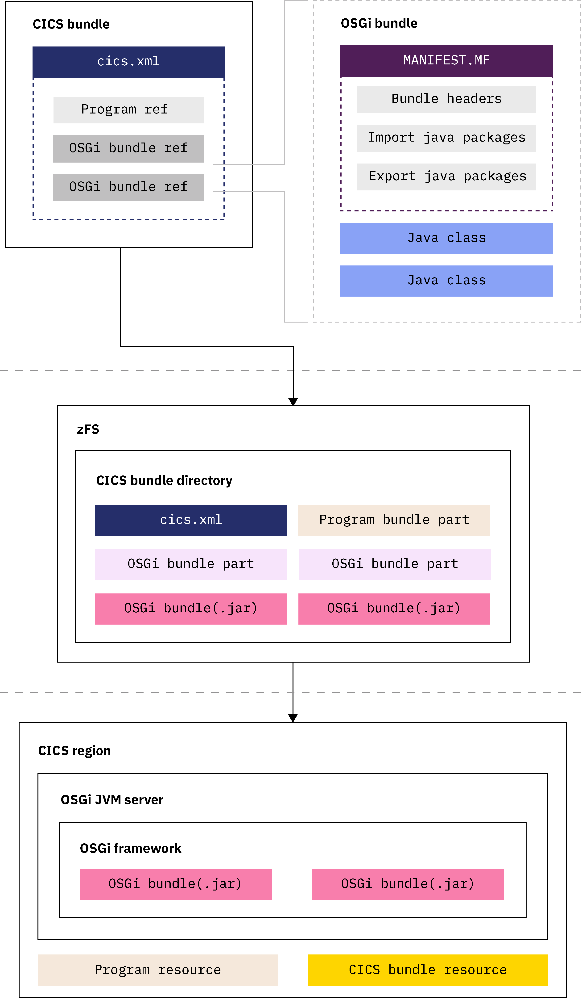
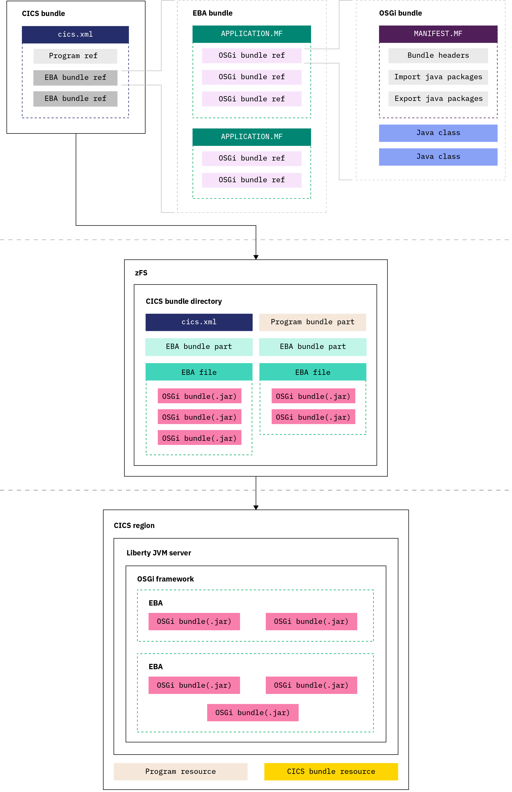
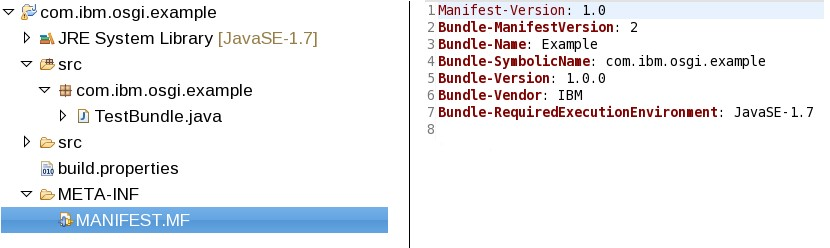

OSGi demystified: bundles of fun
=======================================

Author: Ivan Hargreaves, CICS Java and Liberty Architect. Designer and Senior Developer of JVM
server technologies.


*'OSGi Demystified' is a series of articles addressing common OSGi
issues in CICS. We offer insight into OSGi, discuss best practices, and
provide setup and configuration advice. This first article majors on
OSGi bundles and OSGi
services. OSGi application and architectural guidance is given,
alongside a round-up of useful materials.*

## 1. OSGi bundles

As with all paradigm shifts, it can take a certain amount of education
and persistence to gain advantage from a new technology. So if you are
confounded by Java, bemused by bundles, up-in-arms over OSGi then read
on. Let's face it, the alternative could be that you become irrelevant,
left-behind, or even obsolete. We don't want that.

If you are confident and raring to go, by all means install CICS
Explorer, add the Java/Liberty component, write some Java code, create
an OSGi bundle, and deploy your application to CICS. For the rest of us,
consulting the product documentation is a good start, see [CICS Java
support](https://www.ibm.com/support/knowledgecenter/SSGMCP_5.4.0/fundamentals/java/JVMsupport.html)
-- just in case there is something there of use. You'll be needing this
page too, [CICS Java
troubleshooting](https://www.ibm.com/support/knowledgecenter/SSGMCP_5.4.0/troubleshooting/java/java_troubleshooting.html),
it's the troubleshooting guide for OSGi JVM servers.

### OSGi reminder

OSGi (Open Services Gateway initiative) is a Java framework for
developing and deploying modular software programs and libraries. The
modular components of OSGi are known as OSGi bundles. Each OSGi bundle,
is a tightly coupled, dynamically loadable collection of classes, jars,
and configuration files. Each OSGi bundle explicitly declares the
packages they *provide*, and the packages they *require*.

By enforcing explicit declarations, the OSGi framework can provide a
powerful component model. Beyond the obvious benefits of
componentisation and re-use, the framework uses install-time dependency
resolution to help avoid run-time failures. OSGi also offers a powerful
versioning mechanism where multiple versions of the same class can exist
within the same JVM. Improved class loading performance is realised as a
result of the clearly defined dependencies, and a dynamic service
architecture allows applications to be updated without a server restart.

In CICS, the OSGi JVM server is a Java runtime that incorporates an OSGi
framework. That same technology is used for the Liberty JVM server. The
key difference between the two is that the Liberty JVM server embeds an
instance of a Liberty server. Typically an OSGi JVM server is
appropriate when Java SE APIs are required, and a Liberty JVM server is
appropriate where Web technology and/or Java EE APIs are required.

With the formalities out of the way, let's move on to some
clarifications.

### OSGi bundles are not CICS bundles

That's not a backronym by the way! You'll be surprised how often these
two types of **bundle** can be confused. *CICS* bundles are a package
and deployment mechanism for CICS resources, while *OSGi* bundles are
components of the Java/OSGi system.

Now that distinction is clear in your mind, let's add some confusion.
*CICS* bundles contain one or more resources called *bundle parts*. OSGi
does not have any notion of 'parts', so throughout this text 'bundle
part' will always refer to a CICS bundle part. There are a number of
*bundle parts* relevant to CICS Java and Liberty, and we'll discuss the
Liberty related bundle parts that correspond to *WAR, EAR, and EBA* in
the next instalments. For the moment, let's concentrate on the pure OSGi
solution, and that means the *OSGi bundle part* in an OSGi JVM server.
It should be no surprise to learn that the *OSGi bundle part* allows
CICS to deploy an *OSGi* bundle into an OSGi JVM server when the *CICS*
bundle is enabled. OSGi environments outside of CICS have no concept of
CICS bundles, so OSGi bundles in the wild are generally deployed
directly to the OSGi framework. The CICS approach offers additional
benefit though, like the ability to control the life-cycle of both OSGi
bundles *and* CICS resources within the same packaging mechanism. See
below:



## 2. Bundles in Liberty

This section covers:
-   Enterprise bundle archive and their use in Liberty with OSGi
    bundles.
-   The different ways OSGi JVM server and Liberty embrace library
    bundles.
-   A quick explanation of Java and Liberty related CICS bundle parts.

 
### OSGi bundles in Liberty: EBAs

Given that a *CICS* bundle is essentially a container for one or more
*OSGi bundle parts* with each bundle part referencing an *OSGi* bundle,
let's double the confusion. Liberty ***also*** has a containment
mechanism for OSGi bundles, called an EBA, or *Enterprise bundle
archive*. Importantly though, EBAs aren't just a way to deploy multiple
OSGi bundles, but a way to deploy sets of OSGi bundles as a single
isolated sub-system (think *mini OSGi container per application*). In
practice that means OSGi bundles in different EBAs are not visible to
each other; by intention. Using sub-systems gives Liberty the ability to
isolate applications from each other for both security and integrity
purposes -- but that's a topic for another day! In the meantime it
should suffice to know that CICS steps up to the mark and provides an
*EBA bundle part* for deploying EBAs to CICS Liberty. Ultimately, your
*OSGi* bundle sits inside an EBA, and your EBA sits inside a *CICS*
bundle. It is usually these containment mechanisms, in tandem with
unqualified uses of the term *bundle*, that cause outbreaks of bundle
sickness. Now you have a cure.



### OSGi library bundles -- not so common

Sooner or later you'll discover that applications tend to perform a
subset of similar operations. Perhaps you'll even develop common
libraries and place them in distinct OSGi bundles. Doing so would
demonstrate you've embraced the re-usable component power of OSGi, well
done! Your next challenge is to deploy them to your JVM server making
them accessible from all applications and ensuring that each component,
or library, is installed and ready. It's a great plan, with only a minor
catch. Despite both OSGi JVM server and Liberty embracing library
bundles, they do it in very different ways.

Recall that Liberty uses an OSGi application, or EBA, to create isolated
sub-systems of OSGi bundles. An EBA can contain a set of JAR files (the
physical manifestation of OSGi bundles), *OR* it can contain a 'shopping
list' of OSGi bundle *references*. That 'shopping list' is essentially
an index into something called the *bundle-repository*. You can
configure a *bundle-repository* in Liberty's server.xml. The
*bundle-repository* is a directory on the file-system containing one or
more OSGi bundles. When the shopping list is resolved, OSGi bundles are
taken from the *bundle-repository*, installed into a common OSGi
sub-space, and our EBA is given access to them. In this way, multiple
applications can share common OSGi bundles while still retaining
isolation for their main function.

> If you deploy an OSGi application (EBA) within CICS bundles. The CICS
> Explorer tooling will upload all required OSGi bundles inside the EBA
> (the archive file). To use the 'shopping list' approach you must
> manually develop and deploy the OSGi application (EBA) and manually
> configure a bundle-repository.

In contrast, the OSGi JVM server shares a single OSGi space. Each OSGi
bundle deployed to the OSGi JVM server is potentially available to all
other OSGi bundles that have been deployed. Whether the OSGi bundles
will actually place a dependency on each other, or not, is controlled
through the `Import-Package` and `Export-Package` statements in the
MANIFEST file of the *OSGi* bundle.

Ultimately, in an OSGi JVM server any OSGi bundle can provide common
function, so the OSGi JVM server has a slightly different concept for a
library known as a *middleware* OSGi bundle. A *middleware* OSGi bundle
is one that shares the life-cycle of the container. *Middleware* OSGi
bundles are not deployed inside a CICS bundle. Instead, they are
installed and enabled when the OSGi JVM server is enabled. *Middleware*
OSGi bundles remain enabled for as long as the JVM server is enabled and
can be configured using the JVM profile option:
```
    OSGI_BUNDLES={comma separated list of path qualified OSGi bundles}
```

### WAR, EAR, and EBAs

As promised here's a quick explanation of Java and Liberty related CICS
*bundle parts*. An OSGi *bundle part* is used for deploying a single
*OSGi bundle* to an OSGi JVM server. Liberty doesn't allow direct
deployment of OSGi bundles. It requires a container into which one or
more OSGi bundles can be placed, or referenced. We've discussed the EBA
bundle part in passing already, and there's not really much to add. It's
suffice to say that an *OSGi application project* created by your
Eclipse based WebSphere Developer Tooling will be exported (JAR'd up)
into an EBA. A *CICS bundle* can contain an EBA bundle part, and when
the *CICS bundle* is installed into CICS, the EBA is installed into the
Liberty server instance running inside your Liberty JVM server.

In similar fashion, a (Dynamic) Web Application typically created by the
WebSphere Developer tooling in Eclipse (WDT), will be exported as a WAR
file (Web ARchive). A *CICS bundle* can contain a WAR bundle part, and
the Web application is deployed to Liberty when the *CICS bundle* is
installed. Unsurprisingly that same pattern applies to the final
artifact in our list, the Enterprise Archive (EAR), which has a
corresponding EAR bundle part.

## 3. Bundle misconceptions

This section looks at the:
-   Differences when creating your JAR as an OSGi bundle.
-   Misconceptions of OSGi bundles and application updates.

### An OSGi bundle *is* a JAR

There's absolutely nothing to lose by creating your JAR as an *OSGi
bundle* -- even if ultimately you don't deploy it to an OSGi
environment. The key difference is that an *OSGi bundle* contains more
meta-data in the MANIFEST.MF in the JAR. The meta-data offers at least
three important pieces of information; a unique-id (*Bundle-SymbolicName
and Bundle-Version*), a set of dependencies (*Import-Package*), and the
external interface (*Export-Package*). When not deployed to an OSGi
environment, the meta-data is simply ignored.



### OSGi bundles allow versioning of code

Beware! This statement can give rise to misconceptions. The primary
capability here is about allowing multiple versions of the same
package/class to be available within the same runtime. Two different
applications might have different version requirements on the same
library. OSGi allows both versions to be deployed simultaneously, and
both applications can be satisfied. However, take note: multiple version
support does NOT automatically provide seamless UPDATE of
applications...and that leads us directly to the next point.

### OSGi bundles do NOT provide dynamic update as well as you might expect

The misconception here is that you can deploy a new version of an *OSGi
bundle* to the OSGi environment and everything magically starts using
it. That could be true, but there are several 'it depends' to navigate
first.

For example, it depends on whether you rely on bundle-wiring (the act of
resolving Import-Packages) or whether you are using OSGi services. If
you are using bundle-wiring, it depends on where and when the previous
version was referenced. If some other OSGi bundle (B) uses your OSGi
bundle (A) and successfully resolves against it, OSGi will NOT resolve
to the new version (A') by default. If it did, there is a risk of
breaking a working application. If yet another OSGi bundle was installed
(C), it *might* resolve to the new version of your OSGi bundle (A'), or
it might resolve to the older version (A) -- it is entirely dependent
upon the way in which Import-Package dependencies are expressed. You can
of course control the dependencies by judicious use of the 'version'
attribute on the `Import-Package` statement and by applying minimum
versions and version ranges, but that's hard work and very error prone.

To cut a complex set of interactions short, if you are using
bundle-wiring (Import-Package) to dynamically *update* your
applications, then you'll have to be extremely careful with the order in
which you install the new versions, you'll need to be diligent about
incrementing the OSGi bundle versions, and smart enough to figure out
the right dependency ranges to ensure the whole chain is refreshed
according to your wishes. Our advice: don't do it. Use OSGi services
instead (see later). Alternatively, if you don't mind a little downtime,
you could always disable and re-enable the JVM server!

### Version ranges and semantic versioning are good practice

Regardless of whether you use OSGi services or not, you should employ a
suitable bundle/package versioning scheme allowing you to distinguish
between bug fixes, updates (new function), and interface breakage (API
incompatibilities). OSGi semantic versioning does just that, we would
encourage you to follow that model for your OSGi bundles. A useful
summary is in the [OSGi semantic versioning
paper](https://www.osgi.org/wp-content/uploads/SemanticVersioning.pdf)
from the OSGi Alliance.

Knowing how to version your OSGi bundles is only half the story though.
Using version ranges in your Import statements on top of semantic
versioning can be the difference between *constant resolution problems
with hidden breakages* versus *smooth transitions*. For example:

    a) Import-Packge: com.myorg.package1
    b) Import-Packge: com.myorg.package1;version=1.0.0
    c) Import-Packge: com.myorg.package1;version=[1.0.0, 1.0.1)
    d) Import-Packge: com.myorg.package1;version=[1.0.0, 2.0.0)

 
Using (a) any version might match and it could walk you right into the
classic pitfall of resolving against higher major versions. Doing so has
the potential to break you at runtime because of interface changes.

Using (b) any version from 1.0.0 upwards might resolve and you incur the
same problems as (a). Most developers end up with such a configuration
because it's usually the default tooling generated configuration.

Using (c) imposes a very restrictive match, the curved bracket implies higher
versions are excluded. Using this approach requires updates and
redeployment of the application for every bug-fix in your chain of
dependencies.

Using (d) is a happy medium. Bug fixes and API additions
are tolerated without change. If there is an API breakage the OSGi
bundle fails to resolve and protects you from a potential runtime
failure.

## 4. OSGi Services

This section includes:

-   An explanation of OSGi services and the OSGi Services registry.
-   Declarative services and Service Component Runtime (SCR).
-   How to dynamically update with OSGi Services and declarative
    services.

### OSGi services

With the revelation that dynamic updates done through bundle-wiring
(*Import-Package with version*) are quite bothersome, it is time to talk
about OSGi services. Shift your thinking from imagining an OSGi bundle's
dependencies are on a particular package/version of code -- and imagine
it depends on one or more services. Just as with package-dependencies,
those services are provided by other OSGi bundles (though nothing stops
you providing them in the same OSGi bundle). The big difference is that
services are dynamically registered with a central *OSGi service
repository* rather than being declared statically as `Import-Package`
statements in the MANIFEST.MF. The OSGi service registry is essentially
a dynamic cache of all services and provides a much more flexible way to
facilitate component reuse.

An OSGi bundle can provide or consume one or more OSGi services. To be a
provider, you should register your implementation of a service with the
OSGi service repository; typically under a standard package/interface
naming convention. To be a consumer, look-up a the service from the
service repository and retrieve a service reference.

For any particular interface there can be zero or more services
registered. Unlike `Import-Package` and bundle-wiring, those services
can come and go at any time. In essence, you can replace a service
implementation with something better, stronger, faster, or ***fixed***,
as and when they become available. Of course it isn't entirely
zero-effort, you have to react to the loss of services and the
appearance of newer implementations, and you'll need a policy in place
that determines whether you bind to a new service implementation, stick
with the old, or tolerate loss of a service for a while. OSGi offers
various ways to handle that churn, from ServiceListeners to
ServiceTrackers, through declarative services (DS) and ultimately to
something called Blueprint. For the purposes of brevity we're not going
to discuss all those approaches. Unless you really need fine-grained
programmatic control and are a sucker for boiler plate code, go straight
to declarative services (DS) instead. It is significantly cleaner,
simpler, and more effective.

### OSGi Declarative Services

Declarative services within OSGi are also known as the Service Component
Runtime (SCR). Strictly speaking the XML is the declarative services
part while the runtime is the SCR, but the two are generally used
interchangeably. The vast majority of interaction policies and component
requirements can be expressed in DS's XML syntax, giving you plenty of
flexibility with minimal coding.

So armed with your new approach to using OSGi Services and declarative
services -- how do you address dynamic updates? To start with, the
bundle-wires, or package dependencies, are more stable because your
dependencies are on an interface not on a constantly changing version of
an implementation. Under that interface, there can be one or more
implementing services and you can have a DS policy to determine which
service you use. That policy could be as simple as ***when a newer
implementation of a service is available, bind to it***, or perhaps
***only bind to services from a particular Vendor***.

Service implementations can be registered with an additional set of
properties and it's those properties which can help to implement the
example policies above. When you need a service, you can filter the
matches based on a specific property or combination of properties, LDAP
filter syntax is respected. You can also give services a priority and
bind to the implementation with the highest priority.

The second compelling aspect of declarative services, is that they are
quite forgiving. When you remove an old implementation of a service and
install a newer one, DS (or more precisely the SCR) has built-in
buffering. It is that buffering that ensures requests for service don't
fail during the update window.

Further reading:

-   [Getting started with Declarative
    Services](http://blog.vogella.com/2016/06/21/getting-started-with-osgi-declarative-services/)
-   [OSGi service
    component](http://enroute.osgi.org/services/org.osgi.service.component.html)

## 5. JRE class visibility, bootdelegation and system\.packages\.extra

This section covers:

-   Loading of core JRE packages/classes.
-   The OSGi framework and system bundles.
-   Exceptions to the system bundles process that exposes known extension packages to the system automatically.

In OSGi, loading of core JRE packages/classes (java.\*) is always delegated to the bootstrap class loader. The bootstrap class loader, unsurprisingly, is the class loader that loaded/bootstraps the OSGi environment, don't confuse it with Java's boot class loader. In practice, there is only ever one JRE in the system, and so explicit dependency statements are not required to reach the core JRE classes. For that reason, it is never necessary to add a java.\* dependency to a bundle manifest. However, application bundles that require extended parts of the JRE must code an Import-Package statement; for example vendor-specific extensions javax.\* com.sun.\* and com.ibm.\* require an import. This is because they are not delegated to the bootstrap class loader and are instead treated as part of the OSGi system.

The OSGi framework provides a *system bundle* that exposes known extension packages to the system automatically. An application bundle registers its dependency on those extension packages by including an Import statement, just as it does for all other packages provided by normal OSGi bundles. The advantage of this approach is that extensions can be replaced with newer implementations by installing an *OSGi bundle* that contains the new code.

There is, however, one exception to this process. If a particular package is coded on the OSGi boot delegation list; by means of the *org.osgi.framework.bootdelegation* property; the package is delegated straight to the boot class loader. This action completely bypasses the OSGi class loading mechanism. Although it is convenient, because no Import statement is required to access boot delegated packages, it restricts the flexibility of OSGi and is not considered best practice for anything but core, single version packages.

Occasionally you may encounter vendor-specific extensions that aren't automatically added to the *system bundle* by the OSGi implementation. Don't be tempted to add them to the bootdelegation list. For these cases, and assuming the package is genuinely available from the vendors JRE, the property
*-Dorg.osgi.framework.system.packages.extra* can be used to add the packages to the *system bundle* and allow application Imports to resolve. The following JVM profile excerpts show how one might use these properties:

- Override CICS bootdelegation defaults (dangerous! it replaces the existing list and could break CICS integration)
        `-Dorg.osgi.framework.bootdelegation=com.ibm.xtq.*, com.ibm.xylem.*`

- Extend the CICS bootdelegation defaults (a more acceptable way to add packages to boot delegation)
        `-Dorg.osgi.framework.bootdelegation.extra=com.ibm.something.new.*`

- Extend the System Packages list to expose extra packages through the OSGi system bundle (best approach)
        `-Dorg.osgi.framework.system.packages.extra=com.ibm.xylem.types, com.ibm.xylem, com.ibm.xtq`


## Conclusion

In this article, we have discussed a whole range of OSGi entertainments from bundle-wiring to OSGi services, and class loaders to bootdelgation. There are many interesting gotchas in Java and OSGi! At CICS Java HQ, we use OSGi internally and hope that our experience can help you to realise the full potential of your CICS Java applications.
